# SRL PostgreSQL Schema Design

## 1. Schema Overview

This document defines the normalized PostgreSQL schema for the Shri Sanwariya Road Lines (SRL) business application. It is designed to support the approved business workflows, financial rules, billing process, audit history, document management, and user authorization model described in the project documentation.

The schema follows five essential principles:

1. Payments are the only source of actual money movement.
2. Trips and Bills represent operational and obligation context, not duplicate ledgers.
3. Historical records remain intact; reversal is the mechanism for removing financial effect.
4. Business identifiers stay separate from internal UUID primary keys.
5. Critical financial integrity rules are protected by DB constraints, transactions, and server-side service validation.

The design intentionally separates:

- Authentication and user access
- Operational records
- Financial obligations
- Actual payment movement
- Payment allocations and credit
- Billing and bill versioning
- Structured document templates
- Documents and file metadata
- Audit history
- System configuration

---

## 2. Database Design Principles

### 2.1 Source-of-truth model

- `payments` is the single source of truth for actual incoming and outgoing money movement.
- `trips` stores operational data and financial obligation context.
- `bills` stores billing documents and billing-related state.
- `audit_events` is append-only and captures meaningful changes.
- `documents` stores metadata and storage references; file binaries remain external unless a later implementation explicitly requires DB storage.

### 2.2 Normalization

The schema avoids duplication of actual payment records. It stores:

- master data once (party, vehicle owner, vehicle, user)
- trip-specific details once
- allocation details in normalized child tables
- bill versions and bill lines instead of overwriting history
- document links via association tables instead of copying records

### 2.3 Exact monetary handling

All monetary values use PostgreSQL `NUMERIC(18,2)` or `NUMERIC(20,2)`, never floating-point types.

### 2.4 Time and audit

All timestamps use `TIMESTAMPTZ` to preserve timezone correctness. Business dates remain distinct from system audit timestamps.

### 2.5 Historical retention

The database stores long-lived operational, financial, billing, and audit history. Soft delete is not used for payments or bills; reversal and cancellation workflows preserve history.

---

## 3. Entity Relationship Overview

```mermaid
erDiagram
    USERS ||--o{ AUDIT_EVENTS : acts
    FINANCIAL_YEARS ||--o{ BILLS : manages
    FINANCIAL_YEARS ||--o{ BILL_NUMBERING_SERIES : contains

    PARTIES ||--o{ TRIPS : serves
    PARTIES ||--o{ BILLS : receives
    PARTIES o|--o{ PAYMENTS : source_or_target
    PARTIES ||--o{ PARTY_CREDITS : has
    PARTIES ||--o| PARTY_BILLING_CONFIGS : configures

    VEHICLE_OWNERS ||--o{ MARKET_VEHICLES : owns
    VEHICLE_OWNERS o|--o{ TRIPS : participates
    VEHICLE_OWNERS o|--o{ PAYMENTS : receives

    MARKET_VEHICLES o|--o{ TRIPS : used_by
    OWN_FLEET_VEHICLES o|--o{ TRIPS : used_by
    OWN_FLEET_VEHICLES ||--o{ OWN_FLEET_VEHICLE_STATUS_HISTORY : tracks

    TRIPS ||--o{ TRIP_DESTINATIONS : has
    TRIPS ||--o| TRIP_PARTY_FINANCIALS : calculates
    TRIPS ||--o| TRIP_VEHICLE_OWNER_FINANCIALS : calculates
    TRIPS ||--o{ TRIP_OTHER_CHARGES : records
    TRIPS ||--o{ TRIP_DEDUCTIONS : records
    TRIPS ||--o{ TRIP_UNLOADING_CHARGES : records
    TRIPS ||--o| TRIP_PODS : records
    TRIPS ||--o{ TRIP_ISSUES : raises
    TRIPS ||--o{ OWN_FLEET_EXPENSE_DETAILS : includes
    TRIPS o|--o{ BILL_ITEMS : billed_as
    TRIPS o|--o{ PAYMENT_ALLOCATIONS : allocated_to

    BILLS ||--o{ BILL_ITEMS : contains
    BILLS ||--o{ BILL_VERSIONS : versioned
    BILLS o|--o{ PAYMENT_ALLOCATIONS : allocated_to
    BILLS ||--o{ DOCUMENT_LINKS : linked

    PAYMENTS o|--o{ PAYMENT_ALLOCATIONS : allocates
    PAYMENTS ||--o| PARTY_CREDITS : generates_identity
    PAYMENTS ||--o{ PAYMENT_FIFO_RUNS : classified_in
    PAYMENT_ALLOCATIONS ||--o{ PAYMENT_ALLOCATION_HISTORY : history
    OWN_FLEET_EXPENSE_DETAILS o|--o{ PAYMENT_ALLOCATIONS : settled_by
    PAYMENT_ALLOCATIONS ||--o| PARTY_CREDITS : identifies_credit
    PAYMENTS ||--o{ DOCUMENT_LINKS : linked

    BILL_TEMPLATES ||--o{ BILL_TEMPLATE_COMPONENTS : contains
    BILL_TEMPLATES ||--o{ BILL_TEMPLATE_DYNAMIC_FIELDS : defines
    BILL_TEMPLATES ||--o{ BILL_TEMPLATE_ASSETS : stores
    BILL_TEMPLATES o|--o{ PARTY_BILLING_CONFIGS : assigned
    BILL_TEMPLATES o|--o{ BILL_VERSIONS : originating_template
    DYNAMIC_FIELD_DEFINITIONS ||--o{ BILL_TEMPLATE_DYNAMIC_FIELDS : referenced_by

    DOCUMENTS ||--o{ DOCUMENT_LINKS : linked
    AUDIT_EVENTS }o--|| USERS : actor
```

`DOCUMENT_LINKS` associations to trips, bills, payments, vehicles, and POD records are logical polymorphic links through `entity_type`/`entity_id`; the generic `entity_id` column is not a foreign key to those tables.

---

## 4. Complete Table Inventory

The migration creates the following tables:

1. `users`
2. `user_sessions`
3. `financial_years`
4. `business_settings`
5. `parties`
6. `party_billing_configs`
7. `vehicle_owners`
8. `market_vehicles`
9. `own_fleet_vehicles`
10. `own_fleet_vehicle_status_history`
11. `trips`
12. `trip_destinations`
13. `trip_party_financials`
14. `trip_vehicle_owner_financials`
15. `trip_other_charges`
16. `trip_deductions`
17. `trip_unloading_charges`
18. `trip_pods`
19. `trip_issues`
20. `other_business_categories`
21. `own_fleet_expense_details`
22. `payments`
23. `payment_allocations`
24. `payment_allocation_history`
25. `payment_fifo_runs`
26. `payment_fifo_run_allocations`
27. `party_credits`
28. `bill_numbering_series`
29. `bills`
30. `bill_items`
31. `bill_versions`
32. `bill_version_items`
33. `bill_templates`
34. `bill_template_components`
35. `bill_template_dynamic_fields`
36. `bill_template_assets`
37. `dynamic_field_definitions`
38. `documents`
39. `document_links`
40. `audit_events`

The schema intentionally excludes a traditional accounting ledger and any duplicate payment transaction store outside `payments`. `payment_allocations` is the sole monetary allocation authority; FIFO rows are metadata pointers only.

---

## 5. Authentication and User Tables

### users
- Purpose: Application authentication and role-based authorization.
- Primary key: `id UUID`
- Columns:
  - `id UUID NOT NULL DEFAULT gen_random_uuid() PRIMARY KEY`
  - `name VARCHAR(150) NOT NULL`
  - `mobile_number VARCHAR(20) NOT NULL`
  - `password_hash TEXT NOT NULL`
  - `role VARCHAR(20) NOT NULL CHECK (role IN ('OWNER','STAFF','CA'))`
  - `is_active BOOLEAN NOT NULL DEFAULT true`
  - `last_login_at TIMESTAMPTZ NULL`
  - `created_at TIMESTAMPTZ NOT NULL DEFAULT now()`
  - `updated_at TIMESTAMPTZ NOT NULL DEFAULT now()`
- Foreign keys: None
- Unique constraints: `UNIQUE (mobile_number)`
- Check constraints: `CHECK (mobile_number ~ '^\+?[0-9]{10,15}$')`
- Important indexes: `idx_users_role_is_active`
- Delete/update behavior: RESTRICT on delete; do not hard-delete active user records for audit continuity
- Relationships: one-to-many with `audit_events`, `user_sessions`, and any record created/edited by a user

### user_sessions
- Purpose: Secure authentication/session tracking for mobile-number login.
- Primary key: `id UUID`
- Columns:
  - `id UUID NOT NULL DEFAULT gen_random_uuid() PRIMARY KEY`
  - `user_id UUID NOT NULL REFERENCES users(id) ON DELETE RESTRICT`
  - `session_token_hash TEXT NOT NULL`
  - `refresh_token_hash TEXT NULL`
  - `device_info TEXT NULL`
  - `ip_address INET NULL`
  - `expires_at TIMESTAMPTZ NOT NULL`
  - `last_seen_at TIMESTAMPTZ NULL`
  - `revoked_at TIMESTAMPTZ NULL`
  - `created_at TIMESTAMPTZ NOT NULL DEFAULT now()`
- Foreign keys: `user_id -> users.id`
- Unique constraints: `UNIQUE (session_token_hash)`, `UNIQUE (refresh_token_hash)` when present
- Check constraints: `CHECK (expires_at > created_at)`
- Important indexes: `idx_user_sessions_expires_at`
- Delete/update behavior: RESTRICT; revoke with `revoked_at` and retain session history with the user record
- Relationships: many sessions belong to one user

---

## 6. Financial Year Tables

### financial_years
- Purpose: Financial-year context for reporting, numbering, and historical filtering.
- Primary key: `id UUID`
- Columns:
  - `id UUID NOT NULL DEFAULT gen_random_uuid() PRIMARY KEY`
  - `code VARCHAR(20) NOT NULL`  -- example: `2026-27`
  - `start_date DATE NOT NULL`
  - `end_date DATE NOT NULL`
  - `is_active BOOLEAN NOT NULL DEFAULT false`
  - `created_at TIMESTAMPTZ NOT NULL DEFAULT now()`
  - `updated_at TIMESTAMPTZ NOT NULL DEFAULT now()`
- Foreign keys: None
- Unique constraints: `UNIQUE (code)`, `UNIQUE (start_date, end_date)`
- Check constraints: `CHECK (end_date >= start_date)`
- Important indexes: `idx_financial_years_is_active`
- Delete/update behavior: RESTRICT on delete to preserve historical references
- Relationships: one-to-many with `bill_numbering_series` and `bills`. `payments` has no financial-year FK; reports filter payments by `payment_date` against the selected financial-year boundaries.

---

## 7. Party/Company Tables

### parties
- Purpose: Party or company master record for customers from whom SRL receives money.
- Primary key: `id UUID`
- Columns:
  - `id UUID NOT NULL DEFAULT gen_random_uuid() PRIMARY KEY`
  - `name VARCHAR(200) NOT NULL`
  - `primary_mobile VARCHAR(20) NOT NULL`
  - `full_address TEXT NULL`
  - `city VARCHAR(100) NULL`
  - `state VARCHAR(100) NULL`
  - `pin_code VARCHAR(20) NULL`
  - `gstin VARCHAR(30) NULL`
  - `party_type VARCHAR(30) NOT NULL CHECK (party_type IN ('MARKET_PARTY','COMPANY'))`
  - `billing_address TEXT NULL`
  - `tds_applicable BOOLEAN NOT NULL DEFAULT false`
  - `is_active BOOLEAN NOT NULL DEFAULT true`
  - `created_at TIMESTAMPTZ NOT NULL DEFAULT now()`
  - `updated_at TIMESTAMPTZ NOT NULL DEFAULT now()`
- Foreign keys: None
- Unique constraints: `UNIQUE (gstin)` where `gstin IS NOT NULL`
- Check constraints: `CHECK (name <> '')`, `CHECK (primary_mobile <> '')`
- Important indexes: `idx_parties_name`, `idx_parties_mobile`, `idx_parties_party_type`
- Delete/update behavior: RESTRICT on delete; historical trip/bill references remain intact
- Type rule: `party_type` cannot be changed after any payment references the party; a database trigger protects payment category consistency.
- Relationships: one-to-many with `trips`, `bills`, `payments`, `party_billing_configs`, `party_credits`

### party_billing_configs
- Purpose: Company-specific billing configuration.
- Primary key: `id UUID`
- Columns:
  - `id UUID NOT NULL DEFAULT gen_random_uuid() PRIMARY KEY`
  - `party_id UUID NOT NULL UNIQUE REFERENCES parties(id) ON DELETE RESTRICT`
  - `billing_mode VARCHAR(30) NOT NULL CHECK (billing_mode IN ('INDIVIDUAL','CONSOLIDATED'))`
  - `default_template_id UUID NULL REFERENCES bill_templates(id) ON DELETE SET NULL`
  - `tds_treatment VARCHAR(100) NULL`
  - `required_fields JSONB NOT NULL DEFAULT '{}'::jsonb`
  - `numbering_series_policy JSONB NOT NULL DEFAULT '{}'::jsonb`
  - `created_at TIMESTAMPTZ NOT NULL DEFAULT now()`
  - `updated_at TIMESTAMPTZ NOT NULL DEFAULT now()`
- Foreign keys: `party_id -> parties.id`, `default_template_id -> bill_templates.id`
- Unique constraints: `UNIQUE (party_id)`
- Check constraints: `CHECK (jsonb_typeof(required_fields) = 'object')`, `CHECK (jsonb_typeof(numbering_series_policy) = 'object')`
- Important indexes: `UNIQUE (party_id)`, `idx_party_billing_configs_template_id`
- Delete/update behavior: RESTRICT on party delete; template change does not mutate existing bills
- Relationships: one-to-one with `parties`, many-to-one with `bill_templates`

---

## 8. Vehicle Owner Tables

### vehicle_owners
- Purpose: Market vehicle owners for vehicle-owner-side settlement and payable workflows.
- Primary key: `id UUID`
- Columns:
  - `id UUID NOT NULL DEFAULT gen_random_uuid() PRIMARY KEY`
  - `name VARCHAR(200) NOT NULL`
  - `mobile_number VARCHAR(20) NOT NULL`
  - `is_active BOOLEAN NOT NULL DEFAULT true`
  - `created_at TIMESTAMPTZ NOT NULL DEFAULT now()`
  - `updated_at TIMESTAMPTZ NOT NULL DEFAULT now()`
- Foreign keys: None
- Unique constraints: `UNIQUE (mobile_number)` globally
- Check constraints: `CHECK (name <> '')`
- Important indexes: `idx_vehicle_owners_name`, `idx_vehicle_owners_mobile`
- Delete/update behavior: RESTRICT; historical records stay accessible
- Relationships: one-to-many with `market_vehicles`, `trips`, `payments`

---

## 9. Market Vehicle Tables

### market_vehicles
- Purpose: Vehicles not owned by SRL; associated with a vehicle owner and used on market trips.
- Primary key: `id UUID`
- Columns:
  - `id UUID NOT NULL DEFAULT gen_random_uuid() PRIMARY KEY`
  - `vehicle_number VARCHAR(50) NOT NULL`
  - `vehicle_owner_id UUID NOT NULL REFERENCES vehicle_owners(id) ON DELETE RESTRICT`
  - `is_active BOOLEAN NOT NULL DEFAULT true`
  - `created_at TIMESTAMPTZ NOT NULL DEFAULT now()`
  - `updated_at TIMESTAMPTZ NOT NULL DEFAULT now()`
- Foreign keys: `vehicle_owner_id -> vehicle_owners.id`
- Unique constraints: `UNIQUE (vehicle_number)`
- Check constraints: `CHECK (vehicle_number <> '')`
- Important indexes: `idx_market_vehicles_owner_id`
- Delete/update behavior: RESTRICT to preserve trip history
- Relationships: many-to-one with `vehicle_owners`, one-to-many with `trips`
- Source-of-truth note: `vehicle_owners.mobile_number` is the only authoritative owner mobile value. `market_vehicles` stores only the owner relationship and must not duplicate owner mobile data unless a separately approved historical snapshot is explicitly documented.

---

## 10. Own Fleet Tables

### own_fleet_vehicles
- Purpose: SRL-owned vehicles tracked separately from market vehicles.
- Primary key: `id UUID`
- Columns:
  - `id UUID NOT NULL DEFAULT gen_random_uuid() PRIMARY KEY`
  - `vehicle_number VARCHAR(50) NOT NULL`
  - `manual_state VARCHAR(30) NULL CHECK (manual_state IN ('UNDER_MAINTENANCE','SOLD_REMOVED'))`
  - `is_active BOOLEAN NOT NULL DEFAULT true`
  - `maintenance_notes TEXT NULL`
  - `created_at TIMESTAMPTZ NOT NULL DEFAULT now()`
  - `updated_at TIMESTAMPTZ NOT NULL DEFAULT now()`
- Foreign keys: None
- Unique constraints: `UNIQUE (vehicle_number)`
- Check constraints: `CHECK (vehicle_number <> '')`
- Important indexes: `idx_own_fleet_vehicles_manual_state`
- Delete/update behavior: DO NOT hard-delete sold/removed vehicles; keep history accessible
- Relationships: one-to-many with `trips`, status history table
- State rule: `manual_state` is the only persistent vehicle-state column and is limited to `UNDER_MAINTENANCE` or `SOLD_REMOVED`. The table has no stored `IN_TRIP` or `AVAILABLE` value and no SQL view/trigger derives them; the application computes those display states from trips and `manual_state`.

### own_fleet_vehicle_status_history
- Purpose: Historical lifecycle state changes for own-fleet vehicles.
- Primary key: `id UUID`
- Columns:
  - `id UUID NOT NULL DEFAULT gen_random_uuid() PRIMARY KEY`
  - `own_fleet_vehicle_id UUID NOT NULL REFERENCES own_fleet_vehicles(id) ON DELETE RESTRICT`
  - `state_kind VARCHAR(20) NOT NULL CHECK (state_kind IN ('MANUAL','DERIVED'))`
  - `previous_state VARCHAR(30) NULL`
  - `new_state VARCHAR(30) NOT NULL CHECK (new_state IN ('IN_TRIP','AVAILABLE','UNDER_MAINTENANCE','SOLD_REMOVED'))`
  - `changed_by UUID NOT NULL REFERENCES users(id) ON DELETE RESTRICT`
  - `changed_at TIMESTAMPTZ NOT NULL DEFAULT now()`
  - `reason TEXT NULL`
- Foreign keys: `own_fleet_vehicle_id -> own_fleet_vehicles.id`, `changed_by -> users.id`
- Unique constraints: None
- Check constraints: `CHECK (state_kind <> '')`, `CHECK (previous_state IS NULL OR previous_state IN ('IN_TRIP','AVAILABLE','UNDER_MAINTENANCE','SOLD_REMOVED'))`
- Important indexes: `idx_own_fleet_status_vehicle_id_time`
- Delete/update behavior: RESTRICT and append-only; historical records retained
- Relationships: many-to-one with `own_fleet_vehicles`, one-to-many with `users`
- Historical state note: this append-only table stores state-transition events supplied by the application. SQL validates the `state_kind` and `new_state` value sets independently but does not validate their pairing or generate/validate transitions from trip activity. Effective IN_TRIP/AVAILABLE state and maintenance-assignment eligibility are application/service responsibilities, not SQL-enforced rules.

---

## 11. Trip Tables

### trips
- Purpose: Operational transportation record and trip-level financial obligation context.
- Primary key: `id UUID`
- Columns:
  - `id UUID NOT NULL DEFAULT gen_random_uuid() PRIMARY KEY`
  - `trip_number VARCHAR(100) NOT NULL`
  - `party_id UUID NOT NULL REFERENCES parties(id) ON DELETE RESTRICT`
  - `trip_type VARCHAR(20) NOT NULL CHECK (trip_type IN ('MARKET','COMPANY'))`
  - `vehicle_relationship VARCHAR(20) NOT NULL CHECK (vehicle_relationship IN ('MARKET','OWN_FLEET'))`
  - `market_vehicle_id UUID NULL REFERENCES market_vehicles(id) ON DELETE RESTRICT`
  - `own_fleet_vehicle_id UUID NULL REFERENCES own_fleet_vehicles(id) ON DELETE RESTRICT`
  - `vehicle_owner_id UUID NULL REFERENCES vehicle_owners(id) ON DELETE RESTRICT`
  - `driver_mobile_number VARCHAR(20) NULL`
  - `lr_number VARCHAR(100) NULL`
  - `invoice_number VARCHAR(100) NULL`
  - `status VARCHAR(30) NOT NULL CHECK (status IN ('CREATED','LOADING','IN_TRANSIT','COMPLETED','SETTLED','CANCELLED'))`
  - `trip_date DATE NOT NULL`
  - `loading_date TIMESTAMPTZ NULL`
  - `unloading_date TIMESTAMPTZ NULL`
  - `origin VARCHAR(200) NULL`
  - `destination VARCHAR(200) NULL`
  - `created_by UUID NOT NULL REFERENCES users(id) ON DELETE RESTRICT`
  - `updated_by UUID NULL REFERENCES users(id) ON DELETE RESTRICT`
  - `created_at TIMESTAMPTZ NOT NULL DEFAULT now()`
  - `updated_at TIMESTAMPTZ NOT NULL DEFAULT now()`
- Foreign keys: `party_id -> parties.id`, `market_vehicle_id -> market_vehicles.id`, `own_fleet_vehicle_id -> own_fleet_vehicles.id`, `vehicle_owner_id -> vehicle_owners.id`, `created_by -> users.id`, `updated_by -> users.id`
- Unique constraints: `UNIQUE (trip_number)`, `UNIQUE (lr_number)` where not null, `UNIQUE (invoice_number)` where not null
- Check constraints:
  - `CHECK ((vehicle_relationship = 'MARKET' AND market_vehicle_id IS NOT NULL AND own_fleet_vehicle_id IS NULL) OR (vehicle_relationship = 'OWN_FLEET' AND own_fleet_vehicle_id IS NOT NULL AND market_vehicle_id IS NULL))`
  - `CHECK ((trip_type = 'MARKET' AND market_vehicle_id IS NOT NULL) OR (trip_type = 'COMPANY' AND market_vehicle_id IS NOT NULL) OR (trip_type = 'COMPANY' AND own_fleet_vehicle_id IS NOT NULL))`
  - `CHECK (trip_number <> '')`
- Cross-row enforcement boundary: the SQL checks enforce the selected vehicle-reference shape and permitted trip-type combinations. They do not require a vehicle owner on market trips, prohibit a vehicle owner reference on own-fleet trips, verify that a market trip's owner matches its market vehicle's owner, prevent multiple active own-fleet trips per vehicle, or block assignment during maintenance. The application must enforce those workflow relationships.
- Important indexes: `idx_trips_party_id`, `idx_trips_status`, `idx_trips_trip_date`, `idx_trips_vehicle_owner_id`, `idx_trips_market_vehicle_id`, `idx_trips_own_fleet_vehicle_id`, `idx_trips_lr_number_unique`, `idx_trips_invoice_number_unique`
- Delete/update behavior: RESTRICT on delete of referenced master data; historical trip records retained
- Relationships: many-to-one with `parties`, `market_vehicles`, `own_fleet_vehicles`, `vehicle_owners`, and users; one-to-many with `trip_destinations`, `trip_party_financials`, `trip_vehicle_owner_financials`, `trip_other_charges`, `trip_deductions`, `trip_unloading_charges`, `trip_pods`, `trip_issues`, `bill_items`, `payment_allocations`

---

## 12. Trip Destination Tables

### trip_destinations
- Purpose: Multi-stop trip legs and destinations.
- Primary key: `id UUID`
- Columns:
  - `id UUID NOT NULL DEFAULT gen_random_uuid() PRIMARY KEY`
  - `trip_id UUID NOT NULL REFERENCES trips(id) ON DELETE RESTRICT`
  - `sequence_no INTEGER NOT NULL CHECK (sequence_no > 0)`
  - `from_location VARCHAR(200) NOT NULL`
  - `to_location VARCHAR(200) NOT NULL`
  - `distance_km NUMERIC(10,2) NULL`
  - `created_at TIMESTAMPTZ NOT NULL DEFAULT now()`
- Foreign keys: `trip_id -> trips.id`
- Unique constraints: `UNIQUE (trip_id, sequence_no)`
- Check constraints: `CHECK (distance_km IS NULL OR distance_km >= 0)`
- Important indexes: the unique `(trip_id, sequence_no)` index supports trip lookups
- Delete/update behavior: RESTRICT; destination history is retained with its trip
- Relationships: many-to-one with `trips`

---

## 13. Trip Financial Obligation Tables

### trip_party_financials
- Purpose: Normalized party-side obligation record for a trip. This stores financial calculation inputs and obligations, not actual payment movements.
- Primary key: `id UUID`
- Columns:
  - `id UUID NOT NULL DEFAULT gen_random_uuid() PRIMARY KEY`
  - `trip_id UUID NOT NULL UNIQUE REFERENCES trips(id) ON DELETE RESTRICT`
  - `freight_amount NUMERIC(18,2) NOT NULL DEFAULT 0`
  - `detention_amount NUMERIC(18,2) NOT NULL DEFAULT 0`
  - `tds_amount NUMERIC(18,2) NOT NULL DEFAULT 0`
  - `receivable_amount NUMERIC(18,2) NOT NULL DEFAULT 0`  -- derived cache only; direct writes are rejected by a trigger
  - `created_at TIMESTAMPTZ NOT NULL DEFAULT now()`
  - `updated_at TIMESTAMPTZ NOT NULL DEFAULT now()`
- Foreign keys: `trip_id -> trips.id`
- Unique constraints: `UNIQUE (trip_id)`
- Check constraints: `CHECK (freight_amount >= 0)`, `CHECK (detention_amount >= 0)`, `CHECK (tds_amount >= 0)`
- Important indexes: `UNIQUE (trip_id)` supports the one-to-one lookup
- Delete/update behavior: RESTRICT; financial obligation history is retained
- Relationships: optional one-to-one with `trips`; the migration does not require a financial row for every trip. When present, it supports party-side receivable and settlement calculations.
- Authoritative party formula: gross receivable = freight + party detention + party unloading charges + party other charges; net receivable = gross receivable - party deductions - TDS. Component rows in `trip_party_financials`, `trip_unloading_charges`, `trip_other_charges`, and `trip_deductions` are authoritative. No bill adjustment is included.
- Cache rule: `receivable_amount` is a cache only. AFTER triggers recalculate it in the same transaction after inserts or updates to any formula source. Source-row deletes are rejected by retention triggers. A BEFORE trigger rejects caller-supplied cache values; the recalculation function is the only writer.

### trip_vehicle_owner_financials
- Purpose: Normalized vehicle-owner-side obligation record for market trips.
- Primary key: `id UUID`
- Columns:
  - `id UUID NOT NULL DEFAULT gen_random_uuid() PRIMARY KEY`
  - `trip_id UUID NOT NULL UNIQUE REFERENCES trips(id) ON DELETE RESTRICT`
  - `freight_amount NUMERIC(18,2) NOT NULL DEFAULT 0`
  - `detention_amount NUMERIC(18,2) NOT NULL DEFAULT 0`
  - `payable_amount NUMERIC(18,2) NOT NULL DEFAULT 0`  -- derived cache only; direct writes are rejected by a trigger
  - `created_at TIMESTAMPTZ NOT NULL DEFAULT now()`
  - `updated_at TIMESTAMPTZ NOT NULL DEFAULT now()`
- Foreign keys: `trip_id -> trips.id`
- Unique constraints: `UNIQUE (trip_id)`
- Check constraints: `CHECK (freight_amount >= 0)`, `CHECK (detention_amount >= 0)`
- Important indexes: `UNIQUE (trip_id)` supports the one-to-one lookup
- Delete/update behavior: RESTRICT; financial obligation history is retained
- Relationships: optional one-to-one with `trips`; intended only for market-trip owner payables. The migration does not require a row for every trip or restrict this row to market trips; the application must enforce those workflow rules.
- Authoritative vehicle-owner formula: gross payable = freight + owner detention + owner unloading charges + owner other charges; net payable = gross payable - owner deductions. Component rows in `trip_vehicle_owner_financials`, `trip_unloading_charges`, `trip_other_charges`, and `trip_deductions` are authoritative.
- Cache rule: `payable_amount` is a cache only. AFTER triggers recalculate it in the same transaction after inserts or updates to any formula source. Source-row deletes are rejected by retention triggers. A BEFORE trigger rejects caller-supplied cache values; the recalculation function is the only writer.

### trip_other_charges
- Purpose: Multiple independent other-charge records for a trip, separated by side/context.
- Primary key: `id UUID`
- Columns:
  - `id UUID NOT NULL DEFAULT gen_random_uuid() PRIMARY KEY`
  - `trip_id UUID NOT NULL REFERENCES trips(id) ON DELETE RESTRICT`
  - `side VARCHAR(20) NOT NULL CHECK (side IN ('PARTY','VEHICLE_OWNER'))`
  - `charge_name VARCHAR(150) NOT NULL`
  - `amount NUMERIC(18,2) NOT NULL CHECK (amount > 0)`
  - `remark TEXT NULL`
  - `created_by UUID NOT NULL REFERENCES users(id) ON DELETE RESTRICT`
  - `created_at TIMESTAMPTZ NOT NULL DEFAULT now()`
- Foreign keys: `trip_id -> trips.id`, `created_by -> users.id`
- Unique constraints: None
- Check constraints: `CHECK (charge_name <> '')`
- Important indexes: `idx_trip_other_charges_trip_id`, `idx_trip_other_charges_side`
- Delete/update behavior: RESTRICT; component history is retained with its trip
- Relationships: many-to-one with `trips`; supports multiple independent other-charge adjustments by side

### trip_deductions
- Purpose: Multiple independent deduction records for shortage/damage or other financial adjustments.
- Primary key: `id UUID`
- Columns:
  - `id UUID NOT NULL DEFAULT gen_random_uuid() PRIMARY KEY`
  - `trip_id UUID NOT NULL REFERENCES trips(id) ON DELETE RESTRICT`
  - `side VARCHAR(20) NOT NULL CHECK (side IN ('PARTY','VEHICLE_OWNER'))`
  - `deduction_type VARCHAR(100) NOT NULL`
  - `amount NUMERIC(18,2) NOT NULL CHECK (amount > 0)`
  - `remark TEXT NULL`
  - `created_by UUID NOT NULL REFERENCES users(id) ON DELETE RESTRICT`
  - `created_at TIMESTAMPTZ NOT NULL DEFAULT now()`
- Foreign keys: `trip_id -> trips.id`, `created_by -> users.id`
- Unique constraints: None
- Check constraints: `CHECK (deduction_type <> '')`
- Important indexes: `idx_trip_deductions_trip_id`, `idx_trip_deductions_side`
- Delete/update behavior: RESTRICT; component history is retained with its trip
- Relationships: many-to-one with `trips`; financial adjustment data, distinct from issue or damage status records

### trip_unloading_charges
- Purpose: Destination-specific unloading charges, allowing party-side and vehicle-owner-side values to differ by destination.
- Primary key: `id UUID`
- Columns:
  - `id UUID NOT NULL DEFAULT gen_random_uuid() PRIMARY KEY`
  - `trip_id UUID NOT NULL REFERENCES trips(id) ON DELETE RESTRICT`
  - `trip_destination_id UUID NOT NULL` (composite FK with `trip_id` to `trip_destinations(trip_id,id)`, RESTRICT)
  - `side VARCHAR(20) NOT NULL CHECK (side IN ('PARTY','VEHICLE_OWNER'))`
  - `amount NUMERIC(18,2) NOT NULL CHECK (amount >= 0)`
  - `remark TEXT NULL`
  - `created_by UUID NOT NULL REFERENCES users(id) ON DELETE RESTRICT`
  - `created_at TIMESTAMPTZ NOT NULL DEFAULT now()`
- Foreign keys: `trip_id -> trips.id`, composite `(trip_id, trip_destination_id) -> trip_destinations(trip_id,id)`, `created_by -> users.id`
- Unique constraints: `UNIQUE (trip_destination_id, side)`
- Check constraints: `CHECK (amount >= 0)`
- Important indexes: `idx_trip_unloading_charges_trip_id`, `idx_trip_unloading_charges_side`; unique `(trip_destination_id, side)` supports destination lookup
- Delete/update behavior: RESTRICT on trip or destination deletion to preserve operational and financial history
- Relationships: many-to-one with `trips` and `trip_destinations`; supports destination-specific unloading values

### own_fleet_expense_details
- Purpose: Business context around own-fleet expenses while actual money movement remains in `payments`.
- Primary key: `id UUID`
- Columns:
  - `id UUID NOT NULL DEFAULT gen_random_uuid() PRIMARY KEY`
  - `trip_id UUID NOT NULL REFERENCES trips(id) ON DELETE RESTRICT`
  - `expense_category VARCHAR(30) NOT NULL CHECK (expense_category IN ('DIESEL','FASTAG','BORDER','LOADING','UNLOADING','OTHER'))`
  - `expense_date DATE NOT NULL`
  - `amount NUMERIC(18,2) NOT NULL CHECK (amount >= 0)`
  - `charge_name VARCHAR(150) NULL`
  - `remark TEXT NULL`
  - `trip_destination_id UUID NULL` (composite FK with `trip_id` to `trip_destinations(trip_id,id)`, RESTRICT)
  - `created_by UUID NOT NULL REFERENCES users(id) ON DELETE RESTRICT`
  - `created_at TIMESTAMPTZ NOT NULL DEFAULT now()`
- Foreign keys: `trip_id -> trips.id`, composite `(trip_id, trip_destination_id) -> trip_destinations(trip_id,id)`, `created_by -> users.id`
- Unique constraints: None
- Check constraints: `CHECK (charge_name IS NULL OR charge_name <> '')`
- Important indexes: `idx_own_fleet_expense_details_trip_id`, `idx_own_fleet_expense_details_category`, `idx_payment_allocations_expense_detail_id`
- Delete/update behavior: own-fleet expense detail remains as business context; actual money movement remains in payments
- Relationships: many-to-one with `trips`, optional destination reference; payment mapping is through `payment_allocations`.
- Relationship rule: an expense may exist before payment. A linked allocation must reference an OUTGOING `OWN_FLEET_EXPENSE` payment and an own-fleet trip. One payment may cover multiple details; a partial unique index permits at most one active allocation/payment per detail. A deferred constraint trigger requires the active linked allocation amount to be either zero or exactly the expense amount. Payment amount remains accounted exactly once in `payment_allocations`.

---

## 14. POD/Courier Tables

### trip_pods
- Purpose: Authoritative POD and courier record for trip completion and settlement workflows.
- Primary key: `id UUID`
- Columns:
  - `id UUID NOT NULL DEFAULT gen_random_uuid() PRIMARY KEY`
  - `trip_id UUID NOT NULL REFERENCES trips(id) ON DELETE RESTRICT`
  - `pod_status VARCHAR(30) NOT NULL CHECK (pod_status IN ('PENDING','RECEIVED','SENT','DISPATCHED'))`
  - `docket_number VARCHAR(100) NULL`
  - `courier_partner VARCHAR(100) NULL`
  - `pod_received_at TIMESTAMPTZ NULL`
  - `sent_to_party_at TIMESTAMPTZ NULL`
  - `notes TEXT NULL`
  - `created_at TIMESTAMPTZ NOT NULL DEFAULT now()`
  - `updated_at TIMESTAMPTZ NOT NULL DEFAULT now()`
- Foreign keys: `trip_id -> trips.id`
- Unique constraints: `UNIQUE (trip_id)`, `UNIQUE (docket_number)` where `docket_number IS NOT NULL`
- Check constraints: `CHECK (pod_status <> '')`
- Important indexes: `idx_trip_pods_docket_number_unique`; unique `(trip_id)` supports the one-to-one trip lookup
- Delete/update behavior: RESTRICT; POD and courier history remains attached to its trip
- Relationships: optional one-to-one with `trips`. Documents are associated through generic `document_links` business-record identifiers; there is no direct `trip_pods`-to-document FK.
- Source-of-truth note: `trip_pods` is the single authoritative record for POD status, POD receipt timestamp, courier docket number, and courier sent timestamp. No duplicate POD/courier columns exist on `trips`.

---

## 15. Issue Tables

### trip_issues
- Purpose: Operational issues, exceptions, and dispute tracking.
- Primary key: `id UUID`
- Columns:
  - `id UUID NOT NULL DEFAULT gen_random_uuid() PRIMARY KEY`
  - `trip_id UUID NOT NULL REFERENCES trips(id) ON DELETE RESTRICT`
  - `issue_type VARCHAR(100) NOT NULL`
  - `description TEXT NOT NULL`
  - `reported_by UUID NOT NULL REFERENCES users(id) ON DELETE RESTRICT`
  - `status VARCHAR(30) NOT NULL CHECK (status IN ('OPEN','IN_PROGRESS','RESOLVED','CLOSED'))`
  - `created_at TIMESTAMPTZ NOT NULL DEFAULT now()`
  - `updated_at TIMESTAMPTZ NOT NULL DEFAULT now()`
- Foreign keys: `trip_id -> trips.id`, `reported_by -> users.id`
- Unique constraints: None
- Check constraints: `CHECK (issue_type <> '')`
- Important indexes: `idx_trip_issues_trip_id`, `idx_trip_issues_status`
- Delete/update behavior: RESTRICT; do not delete issue history
- Relationships: many-to-one with `trips`, many-to-one with `users`

---

## 16. Payment Category and Related Tables

### other_business_categories
- Purpose: Owner-managed master for other-business payment/receipt categories.
- Primary key: `id UUID`
- Columns:
  - `id UUID NOT NULL DEFAULT gen_random_uuid() PRIMARY KEY`
  - `category_name VARCHAR(150) NOT NULL`
  - `category_type VARCHAR(20) NOT NULL CHECK (category_type IN ('PAYMENT','RECEIPT'))`
  - `is_active BOOLEAN NOT NULL DEFAULT true`
  - `created_by UUID NOT NULL REFERENCES users(id) ON DELETE RESTRICT`
  - `created_at TIMESTAMPTZ NOT NULL DEFAULT now()`
  - `updated_by UUID NULL REFERENCES users(id) ON DELETE RESTRICT`
  - `updated_at TIMESTAMPTZ NOT NULL DEFAULT now()`
- Foreign keys: `created_by -> users.id`, `updated_by -> users.id`
- Unique constraints: `UNIQUE (category_name, category_type)`
- Check constraints: `CHECK (category_name <> '')`
- Important indexes: `idx_other_business_categories_active`, `idx_other_business_categories_type`
- Delete/update behavior: soft-disable with `is_active=false`; do not hard-delete for audit continuity
- Relationships: many-to-one with users; referenced by `payments.other_business_category_id`
- Category rule: `other_business_categories.category_type` is authoritative. `payments.category` must match the payment direction and category type: `OTHER_BUSINESS_PAYMENT` requires `payment_type='OUTGOING'`, `OTHER_BUSINESS_RECEIPT` requires `payment_type='INCOMING'`, and inactive categories are not selectable for new payment creation by service-layer validation. A category type cannot be changed after payments reference it; a database trigger protects historical entity consistency.

### payments
- Purpose: The authoritative record of incoming and outgoing actual money movement. This table does not carry allocation semantics; it stores the payment itself only.
- Primary key: `id UUID`
- Columns:
  - `id UUID NOT NULL DEFAULT gen_random_uuid() PRIMARY KEY`
  - `payment_id VARCHAR(100) NOT NULL UNIQUE`
  - `payment_type VARCHAR(20) NOT NULL CHECK (payment_type IN ('INCOMING','OUTGOING'))`
  - `category VARCHAR(40) NOT NULL CHECK (category IN ('COMPANY_PAYMENT','MARKET_PARTY_PAYMENT','OTHER_BUSINESS_RECEIPT','VEHICLE_OWNER_PAYMENT','OWN_FLEET_EXPENSE','OTHER_BUSINESS_PAYMENT'))`
  - `other_business_category_id UUID NULL REFERENCES other_business_categories(id) ON DELETE RESTRICT`
  - `party_id UUID NULL REFERENCES parties(id) ON DELETE RESTRICT`
  - `vehicle_owner_id UUID NULL REFERENCES vehicle_owners(id) ON DELETE RESTRICT`
  - `payment_date DATE NOT NULL`
  - `amount NUMERIC(18,2) NOT NULL CHECK (amount > 0)`
  - `payment_mode VARCHAR(30) NOT NULL CHECK (payment_mode IN ('UPI','BANK_TRANSFER','CASH'))`
  - `payment_status VARCHAR(20) NOT NULL CHECK (payment_status IN ('ACTIVE','REVERSED'))`
  - `reversal_reason TEXT NULL`
  - `reversed_by UUID NULL REFERENCES users(id) ON DELETE RESTRICT`
  - `reversed_at TIMESTAMPTZ NULL`
  - `created_by UUID NOT NULL REFERENCES users(id) ON DELETE RESTRICT`
  - `updated_by UUID NULL REFERENCES users(id) ON DELETE RESTRICT`
  - `created_at TIMESTAMPTZ NOT NULL DEFAULT now()`
  - `updated_at TIMESTAMPTZ NOT NULL DEFAULT now()`
- Foreign keys: `other_business_category_id -> other_business_categories.id`, `party_id -> parties.id`, `vehicle_owner_id -> vehicle_owners.id`, `reversed_by -> users.id`, `created_by -> users.id`, `updated_by -> users.id`
- Unique constraints: `UNIQUE (payment_id)`
- Check constraints:
  - `CHECK (payment_status <> 'REVERSED' OR reversed_at IS NOT NULL)`
  - `CHECK ((payment_type = 'INCOMING' AND category IN ('COMPANY_PAYMENT','MARKET_PARTY_PAYMENT','OTHER_BUSINESS_RECEIPT')) OR (payment_type = 'OUTGOING' AND category IN ('VEHICLE_OWNER_PAYMENT','OWN_FLEET_EXPENSE','OTHER_BUSINESS_PAYMENT')))`
  - `CHECK ((category IN ('OTHER_BUSINESS_RECEIPT','OTHER_BUSINESS_PAYMENT') AND other_business_category_id IS NOT NULL) OR (category NOT IN ('OTHER_BUSINESS_RECEIPT','OTHER_BUSINESS_PAYMENT')))`
  - `CHECK` enforces exactly the matching party, vehicle-owner, or other-category reference for each payment category.
  - `CHECK` requires complete reversal metadata for REVERSED rows and forbids it on ACTIVE rows.
- Important indexes: `idx_payments_payment_date`, `idx_payments_party_id`, `idx_payments_vehicle_owner_id`, `idx_payments_status`, `idx_payments_type`, `idx_payments_category`
- Delete/update behavior: never physically delete; reversal sets `payment_status='REVERSED'` and records reversal metadata
- Relationships: many-to-one with parties, vehicle owners, categories and users; one-to-many with `payment_allocations`, allocation history and FIFO metadata; own-fleet expense mapping is through allocations.
- Entity rules: COMPANY_PAYMENT and MARKET_PARTY_PAYMENT are INCOMING and require `party_id`; OTHER_BUSINESS_RECEIPT is INCOMING with a RECEIPT category; VEHICLE_OWNER_PAYMENT is OUTGOING with `vehicle_owner_id`; OWN_FLEET_EXPENSE is OUTGOING; OTHER_BUSINESS_PAYMENT is OUTGOING with a PAYMENT category. Cross-table category-type checks use a deferred constraint trigger.
- Completeness invariant: deferred constraint triggers enforce at commit that an ACTIVE incoming party payment equals active BILL + TRIP + CREDIT_GENERATED allocations, excluding CREDIT_UTILIZED. Other-business receipts reconcile only through OTHER_BUSINESS; outgoing payments reconcile through the entity-appropriate cash allocations. Reversal makes the payment's active cash allocations zero.

---

## 17. Payment Allocation Tables

### payment_allocations
- Purpose: The ONLY authoritative monetary allocation table for payment destinations, credit issuance and credit use.
- Primary key: `id UUID`
- Columns:
  - `id UUID NOT NULL DEFAULT gen_random_uuid() PRIMARY KEY`
  - `payment_id UUID NULL REFERENCES payments(id) ON DELETE RESTRICT`
  - `bill_id UUID NULL REFERENCES bills(id) ON DELETE RESTRICT`
  - `trip_id UUID NULL REFERENCES trips(id) ON DELETE RESTRICT`
  - `own_fleet_expense_detail_id UUID NULL REFERENCES own_fleet_expense_details(id) ON DELETE RESTRICT`
  - `vehicle_owner_id UUID NULL REFERENCES vehicle_owners(id) ON DELETE RESTRICT`
  - `party_credit_source_id UUID NULL REFERENCES payment_allocations(id) ON DELETE RESTRICT`
  - `allocation_type VARCHAR(40) NOT NULL CHECK (allocation_type IN ('BILL','TRIP','CREDIT_GENERATED','CREDIT_UTILIZED','VEHICLE_OWNER','OWN_FLEET_EXPENSE','OTHER_BUSINESS'))`
  - `allocation_amount NUMERIC(18,2) NOT NULL CHECK (allocation_amount > 0)`
  - `allocation_status VARCHAR(20) NOT NULL CHECK (allocation_status IN ('ACTIVE','REVERSED'))`
  - `reversed_at TIMESTAMPTZ NULL`
  - `created_by UUID NOT NULL REFERENCES users(id) ON DELETE RESTRICT`
  - `created_at TIMESTAMPTZ NOT NULL DEFAULT now()`
  - `updated_at TIMESTAMPTZ NOT NULL DEFAULT now()`
- Foreign keys: optional `payment_id -> payments.id`, `bill_id -> bills.id`, `trip_id -> trips.id`, `own_fleet_expense_detail_id -> own_fleet_expense_details.id`, `vehicle_owner_id -> vehicle_owners.id`, `party_credit_source_id -> payment_allocations.id`, `created_by -> users.id`
- Unique constraints: None
- Check constraints: BILL targets a bill; TRIP targets a trip; CREDIT_GENERATED has no target; CREDIT_UTILIZED targets exactly one bill or trip and a distinct source allocation; VEHICLE_OWNER targets an owner; OWN_FLEET_EXPENSE targets one expense; OTHER_BUSINESS has no business-record target. Only CREDIT_UTILIZED may omit `payment_id`; all other allocation types require it. Credit source cannot equal the allocation itself. REVERSED requires `reversed_at`.
- Important indexes: `idx_payment_allocations_payment_id`, `idx_payment_allocations_trip_id`, `idx_payment_allocations_bill_id`, `idx_payment_allocations_status`, `idx_payment_allocations_type`, `idx_payment_allocations_expense_detail_id`, and an active partial unique index on own-fleet expense detail.
- Delete/update behavior: do not physically delete; reversal uses `allocation_status='REVERSED'`
- Relationships: many-to-one with payments, trips, bills, expense details, vehicle owners, credit source allocations and allocation history.
- Authority note: every amount that allocates cash or issues/utilizes party credit exists exactly once here. CREDIT_GENERATED belongs to its original incoming payment and is tied to the party by `party_credits`. The application/FIFO allocator determines the applicable receivables and chooses any excess amount to generate as credit; SQL enforces payment completeness and credit-source identity but does not calculate that excess boundary. CREDIT_UTILIZED references that source allocation, may have no payment context, is non-cash, and is excluded from every payment completeness sum. If a context payment is provided, it is only metadata and may differ from the source payment.

### payment_allocation_history
- Purpose: Immutable event history for allocation creation, edit, reversal, reallocation, and FIFO allocation actions.
- Primary key: `id UUID`
- Columns:
  - `id UUID NOT NULL DEFAULT gen_random_uuid() PRIMARY KEY`
  - `allocation_id UUID NOT NULL REFERENCES payment_allocations(id) ON DELETE RESTRICT`
  - `event_type VARCHAR(30) NOT NULL CHECK (event_type IN ('CREATED','EDITED','REVERSED','REALLOCATED','FIFO_ALLOCATED'))`
  - `previous_amount NUMERIC(18,2) NULL`
  - `new_amount NUMERIC(18,2) NULL`
  - `event_by UUID NOT NULL REFERENCES users(id) ON DELETE RESTRICT`
  - `event_at TIMESTAMPTZ NOT NULL DEFAULT now()`
  - `reason TEXT NULL`
- Foreign keys: `allocation_id -> payment_allocations.id`, `event_by -> users.id`
- Unique constraints: None
- Check constraints: `CHECK (previous_amount IS NULL OR previous_amount >= 0)`, `CHECK (new_amount IS NULL OR new_amount >= 0)`
- Important indexes: `idx_payment_allocation_history_allocation_id`, `idx_payment_allocation_history_event_at`
- Delete/update behavior: SQL trigger rejects UPDATE and DELETE. The migration does not auto-insert history rows; payment/allocation services must insert event rows in the same transaction as the business operation.
- Relationships: one-to-many with `payment_allocations`

### payment_fifo_runs
- Purpose: Batch-level wrapper for FIFO execution associated with an incoming payment. A credit-only FIFO run may use its source payment as the metadata key; the run never represents new cash or financial allocation.
- Primary key: `id UUID`
- Columns:
  - `id UUID NOT NULL DEFAULT gen_random_uuid() PRIMARY KEY`
  - `payment_id UUID NOT NULL REFERENCES payments(id) ON DELETE RESTRICT`
  - `run_number INTEGER NOT NULL CHECK (run_number > 0)`
  - `run_status VARCHAR(20) NOT NULL CHECK (run_status IN ('ACTIVE','PARTIAL','COMPLETED','REVERSED'))`
  - `created_by UUID NOT NULL REFERENCES users(id) ON DELETE RESTRICT`
  - `created_at TIMESTAMPTZ NOT NULL DEFAULT now()`
- Foreign keys: `payment_id -> payments.id`, `created_by -> users.id`
- Unique constraints: `UNIQUE (payment_id, run_number)`
- Check constraints: `run_number > 0`, `run_status` in the declared values.
- Important indexes: `idx_payment_fifo_runs_status`; unique `(payment_id, run_number)` supports payment lookup.
- Delete/update behavior: append-only; status is recorded on insertion and cannot later be updated. Payment reversal changes canonical payment allocations, not FIFO metadata.
- Relationships: many-to-one with `payments`; one-to-many with `payment_fifo_run_allocations`
- FIFO authority note: `payment_fifo_runs` is execution metadata only. The financial result of the FIFO algorithm is materialized into `payment_allocations` rows. A FIFO run does not independently create an additional accounting amount.

### payment_fifo_run_allocations
- Purpose: Immutable execution-detail rows for each step of FIFO application. They record the ordering and target selection used to construct the canonical allocation rows.
- Primary key: `id UUID`
- Columns:
  - `id UUID NOT NULL DEFAULT gen_random_uuid() PRIMARY KEY`
  - `fifo_run_id UUID NOT NULL REFERENCES payment_fifo_runs(id) ON DELETE RESTRICT`
  - `allocation_id UUID NOT NULL REFERENCES payment_allocations(id) ON DELETE RESTRICT`
  - `target_trip_id UUID NULL REFERENCES trips(id) ON DELETE RESTRICT`
  - `target_bill_id UUID NULL REFERENCES bills(id) ON DELETE RESTRICT`
  - `allocation_sequence INTEGER NOT NULL CHECK (allocation_sequence > 0)`
  - `receivable_before NUMERIC(18,2) NOT NULL DEFAULT 0`
  - `receivable_after NUMERIC(18,2) NOT NULL DEFAULT 0`
  - `created_at TIMESTAMPTZ NOT NULL DEFAULT now()`
- Foreign keys: `fifo_run_id -> payment_fifo_runs.id`, `allocation_id -> payment_allocations.id`, `target_trip_id -> trips.id`, `target_bill_id -> bills.id`
- Unique constraints: `UNIQUE (fifo_run_id, allocation_sequence)`, `UNIQUE (allocation_id)`
- Check constraints: a trip or bill target is set for BILL/TRIP/CREDIT_UTILIZED allocations; CREDIT_GENERATED metadata has neither target. The deferred FIFO trigger matches target and payment context/source to the referenced canonical allocation. Before/after receivable snapshots are non-negative.
- Important indexes: `idx_payment_fifo_run_allocations_target_trip_id`, `idx_payment_fifo_run_allocations_target_bill_id`; unique `(fifo_run_id, allocation_sequence)` and `UNIQUE (allocation_id)` support mapping lookups
- Delete/update behavior: RESTRICT; execution metadata does not cascade-delete with payment or run history
- Relationships: many-to-one with `payment_fifo_runs` and `payment_allocations`; direct mapping to specific receivable target
- Mapping rule: each FIFO execution row references a `payment_allocations` row; no allocated or credit amount is duplicated in FIFO tables. `receivable_before` and `receivable_after` are non-authoritative replay snapshots only.

---

## 18. Credit Tables

### party_credits
- Purpose: Non-monetary identity/reference for a credit account generated by an incoming party payment. All credit amounts and uses remain in `payment_allocations`.
- Primary key: `id UUID`
- Columns:
  - `id UUID NOT NULL DEFAULT gen_random_uuid() PRIMARY KEY`
  - `party_id UUID NOT NULL REFERENCES parties(id) ON DELETE RESTRICT`
  - `payment_id UUID NOT NULL REFERENCES payments(id) ON DELETE RESTRICT`
  - `credit_allocation_id UUID NOT NULL UNIQUE REFERENCES payment_allocations(id) ON DELETE RESTRICT`
  - `created_at TIMESTAMPTZ NOT NULL DEFAULT now()`
- Foreign keys: `party_id -> parties.id`, `payment_id -> payments.id`, `credit_allocation_id -> payment_allocations.id`
- Unique constraints: `UNIQUE (payment_id)`, `UNIQUE (credit_allocation_id)`
- Important indexes: `idx_party_credits_party_id`
- Delete/update behavior: RESTRICT; the referenced payment and issuance allocation remain historical
- Relationships: many-to-one with `parties` and `payments`; one-to-one with its issuance allocation
- Authority rule: no `credit_amount`, `available_credit`, or `utilized_credit` is stored here. For each source allocation, available credit = sum of active CREDIT_GENERATED amount less the sum of active CREDIT_UTILIZED amounts referencing it. Both sums require an active source payment/allocation; optional utilization context must also be active. Reversal marks the source allocation and all dependent uses REVERSED, so effective credit becomes zero.

---

## 19. FIFO Allocation Model

The FIFO model uses `payment_allocations` as its only monetary layer. FIFO tables store execution metadata and non-authoritative receivable snapshots only.

### Design intent

- A bulk incoming payment is stored once in `payments`.
- The payment is grouped into a `payment_fifo_runs` batch.
- Each FIFO allocation step is recorded in `payment_fifo_run_allocations` with an ordering index and a specific target trip or bill.
- Each FIFO execution step must map to the resulting `payment_allocations` row through `payment_fifo_run_allocations.allocation_id`.
- The service layer uses the run order and the target receivable sequence to determine which balances are consumed first.
- When the application/FIFO allocator determines an incoming company/market-party payment exceeds applicable receivables, it creates a `CREDIT_GENERATED` allocation with a `party_credits` identity row; SQL validates that choice against payment completeness but does not calculate applicable receivables. Vehicle-owner payments do not create credit.
- Existing party credit can be consumed during FIFO by a canonical `CREDIT_UTILIZED` allocation referencing the source credit. This row is excluded from payment completeness, and the FIFO row stores only its pointer/order/target, never an amount.
- Reversal and reallocation create new allocation history records instead of mutating old allocation rows.

### Authority and audit separation

- Authoritative financial allocation: `payment_allocations`
- Execution / replay / audit detail: `payment_fifo_runs` and `payment_fifo_run_allocations`
- A single payment must never be counted twice because both FIFO tables are interpreted as financial allocations. FIFO execution rows are not counted as a second ledger; they only explain how the canonical allocation was produced.

### Mapping rule

For each FIFO step:

- `payment_fifo_runs` contains the batch metadata for the payment.
- `payment_fifo_run_allocations` contains the ordered target mapping and `allocation_id` pointer to the canonical `payment_allocations` row; it stores no amount. FIFO may map a CREDIT_UTILIZED row against existing credit, using its optional payment context or, when absent, the source payment only as a metadata run key.
- The deferred payment constraint trigger reconciles active `BILL`, `TRIP`, and `CREDIT_GENERATED` allocation amounts to an incoming party payment. CREDIT_UTILIZED and all FIFO rows never enter this sum.

### Reversal and reallocation

- Reversal of a payment or allocation marks the canonical allocation row as `allocation_status='REVERSED'` and records the reason in `payment_allocation_history`.
- Payment reversal automatically marks all its active allocations REVERSED. Credit remaining is then derived as zero for that source payment; FIFO metadata remains historical and does not create financial contribution.
- Reallocation creates a new `payment_allocations` record or a new versioned allocation and then records the event in `payment_allocation_history`; the old allocation becomes inactive/reversed and is excluded from all active totals.

### Credit representation and use

- Credit is generated by a `CREDIT_GENERATED` row in `payment_allocations`; `party_credits` stores only the account identity and source references.
- Credit is consumed against a future bill or trip by a `CREDIT_UTILIZED` row referencing the generating allocation. No future cash payment is required. Utilization reduces the source credit's remaining balance; bill-targeted use contributes to bill paid amount.
- A deferred constraint trigger locks and validates the source allocation, requires an ACTIVE CREDIT_GENERATED row and ACTIVE incoming source payment, matches `party_credits` identity and target party, rejects self/circular references, and prevents the sum of active uses from exceeding the source amount. A context `payment_id` is optional and, if present, must be an active incoming party payment for the target party; it may differ from the source payment. Triggers also prevent changing the party of a bill with active credit use or cancelling/changing the party of a trip with active credit use.
- Reversing the source payment or generated allocation automatically reverses all dependent CREDIT_UTILIZED rows. No utilization remains effective and the credit cannot be used again.

### Service-layer enforcement

PostgreSQL CHECK constraints cannot aggregate cross-row sums. DEFERRABLE INITIALLY DEFERRED constraint triggers run at transaction commit, after all payment/allocation/credit rows in the transaction exist, and enforce:

- Incoming party payment: active BILL + TRIP + CREDIT_GENERATED allocation amounts equal `payments.amount`.
- Other-business receipt: active OTHER_BUSINESS allocation amounts equal `payments.amount`.
- Outgoing payment: active TRIP + VEHICLE_OWNER + OWN_FLEET_EXPENSE + OTHER_BUSINESS allocation amounts equal `payments.amount`.
- Entity consistency, credit utilization bounds, and payment reversal's zero active-allocation condition are checked by the same deferred mechanism.

This is a high-integrity business rule and must be validated in transaction code and with a reconciliation query before a payment is considered complete/closed.

---

## 20. Bill Tables

### bills
- Purpose: Billing document for one party/company, optionally with either a single trip or multiple trips.
- Primary key: `id UUID`
- Columns:
  - `id UUID NOT NULL DEFAULT gen_random_uuid() PRIMARY KEY`
  - `bill_number VARCHAR(100) NOT NULL`
  - `party_id UUID NOT NULL REFERENCES parties(id) ON DELETE RESTRICT`
  - `financial_year_id UUID NOT NULL REFERENCES financial_years(id) ON DELETE RESTRICT`
  - `bill_status VARCHAR(20) NOT NULL CHECK (bill_status IN ('GENERATED','SUBMITTED','PAID','CANCELLED'))`
  - `billing_mode VARCHAR(30) NOT NULL CHECK (billing_mode IN ('INDIVIDUAL','CONSOLIDATED'))`
  - `bill_date DATE NOT NULL`
  - `submitted_at TIMESTAMPTZ NULL`
  - `paid_at TIMESTAMPTZ NULL`  -- derived cache only; maintained by SQL triggers
  - `total_amount NUMERIC(18,2) NOT NULL DEFAULT 0`  -- derived cache of current active bill lines
  - `balance_amount NUMERIC(18,2) NOT NULL DEFAULT 0`  -- derived cache after active allocations
  - `cancel_reason TEXT NULL`
  - `cancelled_by UUID NULL REFERENCES users(id) ON DELETE RESTRICT`
  - `cancelled_at TIMESTAMPTZ NULL`
  - `created_by UUID NOT NULL REFERENCES users(id) ON DELETE RESTRICT`
  - `created_at TIMESTAMPTZ NOT NULL DEFAULT now()`
  - `updated_at TIMESTAMPTZ NOT NULL DEFAULT now()`
- Foreign keys: `party_id -> parties.id`, `financial_year_id -> financial_years.id`, `cancelled_by -> users.id`, `created_by -> users.id`
- Unique constraints: `UNIQUE (bill_number, financial_year_id)`
- Check constraints:
  - `CHECK (bill_number <> '')`
  - `CHECK (bill_status <> 'SUBMITTED' OR submitted_at IS NOT NULL)`
  - `CHECK (total_amount >= 0)`
  - `CHECK (balance_amount >= 0)`
  - `CHECK (bill_status <> 'CANCELLED' OR cancel_reason IS NOT NULL)`
  - `CHECK (bill_status <> 'CANCELLED' OR cancelled_by IS NOT NULL)`
  - `CHECK (bill_status <> 'CANCELLED' OR cancelled_at IS NOT NULL)`
- Important indexes: `idx_bills_party_id`, `idx_bills_financial_year_id`, `idx_bills_bill_status`; unique `(bill_number, financial_year_id)` supports bill-number lookup
- Delete/update behavior: do not hard-delete active or historical bills; cancellation metadata remains and payment allocations remain auditable
- Relationships: many-to-one with `parties`, `financial_years`, and users; one-to-many with `bill_items`, `bill_versions`, `payment_allocations`
- Financial model: bill total = `SUM(bill_items.line_amount)` for active current lines. Outstanding = bill total - active incoming BILL allocations - active CREDIT_UTILIZED allocations. No other adjustment category exists. Deferred triggers reject over-allocation; reversal automatically reverses allocations and recalculates bill state.
- Cache/status enforcement: `total_amount`, `balance_amount`, and `paid_at` are derived caches. AFTER triggers recalculate after line, allocation, or reversal changes; a BEFORE trigger rejects direct writes. `PAID` is trigger-derived only when active allocations fully cover a positive bill total. On recalculation, a non-cancelled unpaid bill is set to `SUBMITTED` when `submitted_at` exists, else `GENERATED`; the application must set `bill_status='SUBMITTED'` and `submitted_at` together because changing `submitted_at` alone does not fire a recalculation trigger. `CANCELLED` is terminal.
- Active trip uniqueness: `bill_items.is_active` is maintained from bill status. A partial unique index on active non-null `bill_items.trip_id` allows only one active bill item per trip, for individual and consolidated bills. Cancellation deactivates lines and releases the trip for rebilling.

---

## 21. Bill Item Tables

### bill_items
- Purpose: Authoritative current billed lines for bill-total calculation and trip-to-bill membership. Historical line rendering comes from immutable `bill_version_items`.
- Primary key: `id UUID`
- Columns:
  - `id UUID NOT NULL DEFAULT gen_random_uuid() PRIMARY KEY`
  - `bill_id UUID NOT NULL REFERENCES bills(id) ON DELETE RESTRICT`
  - `trip_id UUID NULL REFERENCES trips(id) ON DELETE RESTRICT`
  - `sequence_no INTEGER NOT NULL CHECK (sequence_no > 0)`
  - `description TEXT NOT NULL`
  - `quantity NUMERIC(18,2) NULL`
  - `unit_price NUMERIC(18,2) NULL`
  - `line_amount NUMERIC(18,2) NOT NULL DEFAULT 0`
  - `is_active BOOLEAN NOT NULL DEFAULT true`
  - `created_at TIMESTAMPTZ NOT NULL DEFAULT now()`
  - `updated_at TIMESTAMPTZ NOT NULL DEFAULT now()`
- Foreign keys: `bill_id -> bills.id`, `trip_id -> trips.id`
- Unique constraints: `UNIQUE (bill_id, sequence_no)`
- Check constraints: `CHECK (line_amount >= 0)`, `CHECK (unit_price IS NULL OR unit_price >= 0)`, `CHECK (quantity IS NULL OR quantity >= 0)`
- Important indexes: `idx_bill_items_trip_id`, partial unique index `idx_bill_items_active_trip_unique` on active non-null trip IDs
- Delete/update behavior: RESTRICT; cancellation deactivates rather than deletes lines
- Relationships: many-to-one with `bills`; many-to-one with `trips`
- Cross-row enforcement boundary: SQL enforces at most one active bill item per trip across individual and consolidated bills and matches current lines to the active version snapshot. It does not verify that each selected trip has the same party as the bill; bill-generation services must enforce party eligibility.

---

## 22. Bill Version Tables

### bill_versions
- Purpose: Immutable version header metadata for a bill number. Only the latest active version is current; previous versions are read-only snapshots.
- Primary key: `id UUID`
- Columns:
  - `id UUID NOT NULL DEFAULT gen_random_uuid() PRIMARY KEY`
  - `bill_id UUID NOT NULL REFERENCES bills(id) ON DELETE RESTRICT`
  - `version_number INTEGER NOT NULL CHECK (version_number > 0)`
  - `version_label VARCHAR(20) NOT NULL`
  - `version_status VARCHAR(20) NOT NULL CHECK (version_status IN ('ACTIVE','SUPERSEDED','CANCELLED'))`
  - `template_id UUID NULL REFERENCES bill_templates(id) ON DELETE SET NULL`
  - `template_snapshot JSONB NOT NULL`
  - `header_snapshot JSONB NOT NULL DEFAULT '{}'::jsonb`
  - `totals_snapshot JSONB NOT NULL DEFAULT '{}'::jsonb`
  - `resolved_dynamic_fields JSONB NULL`
  - `document_reference VARCHAR(255) NULL`
  - `created_by UUID NOT NULL REFERENCES users(id) ON DELETE RESTRICT`
  - `created_at TIMESTAMPTZ NOT NULL DEFAULT now()`
- Foreign keys: `bill_id -> bills.id`, `template_id -> bill_templates.id`, `created_by -> users.id`
- Unique constraints: `UNIQUE (bill_id, version_number)`
- Check constraints: `template_snapshot` is an object containing required object `layout` and required arrays `components`, `assets`, and `dynamic_field_definitions`; `header_snapshot` and `totals_snapshot` are objects; `version_label` is non-empty.
- Important indexes: `idx_bill_versions_template_id`, `idx_bill_versions_status`, partial unique `idx_bill_versions_one_active_per_bill`; unique `(bill_id, version_number)` supports bill lookup
- Delete/update behavior: RESTRICT; snapshots are trigger-protected from mutation/deletion, while version status may advance
- Relationships: many-to-one with `bills`; many-to-one with `bill_templates`; one-to-many with `bill_version_items`
- Authority note: `bill_items` are current bill lines; `bill_version_items` are immutable historical line snapshots; `template_snapshot` is the authoritative historical layout snapshot. A BEFORE INSERT trigger captures layout, components, asset storage keys/checksums, and dynamic field definitions from the selected template. `template_id` is only an originating-template reference and may become NULL. Snapshot mutation is rejected; referenced asset objects must be retained immutably by checksum-addressed external storage.

### bill_version_items
- Purpose: Immutable line-level snapshot for a historical bill version. This is the authoritative source for reconstructing past versions.
- Primary key: `id UUID`
- Columns:
  - `id UUID NOT NULL DEFAULT gen_random_uuid() PRIMARY KEY`
  - `bill_version_id UUID NOT NULL REFERENCES bill_versions(id) ON DELETE RESTRICT`
  - `trip_id UUID NULL REFERENCES trips(id) ON DELETE RESTRICT`
  - `sequence_no INTEGER NOT NULL CHECK (sequence_no > 0)`
  - `description TEXT NOT NULL`
  - `quantity NUMERIC(18,2) NULL`
  - `unit_price NUMERIC(18,2) NULL`
  - `line_amount NUMERIC(18,2) NOT NULL DEFAULT 0`
  - `created_at TIMESTAMPTZ NOT NULL DEFAULT now()`
- Foreign keys: `bill_version_id -> bill_versions.id`, `trip_id -> trips.id`
- Unique constraints: `UNIQUE (bill_version_id, sequence_no)`
- Check constraints: `CHECK (line_amount >= 0)`, `CHECK (unit_price IS NULL OR unit_price >= 0)`, `CHECK (quantity IS NULL OR quantity >= 0)`
- Important indexes: `idx_bill_version_items_trip_id`; unique `(bill_version_id, sequence_no)` supports version-item lookup
- Delete/update behavior: RESTRICT; UPDATE and DELETE are rejected by an append-only trigger
- Relationships: many-to-one with `bill_versions`; many-to-one with `trips`
- Correction rule: editing a bill creates a new `bill_versions` record and a new `bill_version_items` snapshot under the same bill number; it does not generate a new bill number or overwrite historical version data.

---

## 23. Bill Numbering Tables

### bill_numbering_series
- Purpose: Per-company numbering series for bill numbers, reset every financial year.
- Primary key: `id UUID`
- Columns:
  - `id UUID NOT NULL DEFAULT gen_random_uuid() PRIMARY KEY`
  - `party_id UUID NOT NULL REFERENCES parties(id) ON DELETE RESTRICT`
  - `financial_year_id UUID NOT NULL REFERENCES financial_years(id) ON DELETE RESTRICT`
  - `series_code VARCHAR(50) NOT NULL`
  - `prefix VARCHAR(50) NOT NULL`
  - `current_number INTEGER NOT NULL DEFAULT 0`
  - `is_active BOOLEAN NOT NULL DEFAULT true`
  - `created_by UUID NOT NULL REFERENCES users(id) ON DELETE RESTRICT`
  - `created_at TIMESTAMPTZ NOT NULL DEFAULT now()`
  - `updated_at TIMESTAMPTZ NOT NULL DEFAULT now()`
- Foreign keys: `party_id -> parties.id`, `financial_year_id -> financial_years.id`, `created_by -> users.id`
- Unique constraints: `UNIQUE (party_id, financial_year_id, series_code)`
- Check constraints: `CHECK (current_number >= 0)`, `CHECK (prefix <> '')`, `CHECK (series_code <> '')`
- Important indexes: `idx_bill_numbering_series_fy_id`, `idx_bill_numbering_series_active`; unique `(party_id, financial_year_id, series_code)` supports party lookup
- Delete/update behavior: RESTRICT on party delete; cancelled numbers never reused by service logic
- Relationships: many-to-one with `parties`; many-to-one with `financial_years`
- Concurrency rule: bill number generation must use a transactional row lock (`SELECT ... FOR UPDATE`) and then atomically increment `current_number` before inserting the `bills` record. This prevents two simultaneous bill generations from receiving the same number. Cancelled numbers are never reused and are excluded from the sequence by service logic.

---

## 24. Billing Configuration Tables

The main billing configuration table is `party_billing_configs`. Billing templates, template assets, and dynamic field definitions are described in the Bill Designer section below because they are part of the bill template system.

---

## 25. Bill Designer Tables

### bill_templates
- Purpose: Structured bill templates used to generate bills from editable document elements.
- Primary key: `id UUID`
- Columns:
  - `id UUID NOT NULL DEFAULT gen_random_uuid() PRIMARY KEY`
  - `name VARCHAR(200) NOT NULL`
  - `template_type VARCHAR(30) NOT NULL CHECK (template_type IN ('INDIVIDUAL','CONSOLIDATED','MULTI_PAGE'))`
  - `status VARCHAR(20) NOT NULL CHECK (status IN ('DRAFT','ACTIVE','ARCHIVED'))`
  - `layout_json JSONB NOT NULL DEFAULT '{}'::jsonb`
  - `created_by UUID NOT NULL REFERENCES users(id) ON DELETE RESTRICT`
  - `created_at TIMESTAMPTZ NOT NULL DEFAULT now()`
  - `updated_at TIMESTAMPTZ NOT NULL DEFAULT now()`
- Foreign keys: `created_by -> users.id`
- Unique constraints: `UNIQUE (name)`
- Check constraints: `CHECK (jsonb_typeof(layout_json) = 'object')`
- Important indexes: `idx_bill_templates_status`; `UNIQUE (name)` supports template-name lookup
- Delete/update behavior: archive instead of hard-delete where in active use; historical versions remain intact
- Relationships: one-to-many with `party_billing_configs`, `bill_versions`, `bill_template_components`, `bill_template_dynamic_fields`, `bill_template_assets`

### bill_template_components
- Purpose: Structured elements in a bill template, such as text, tables, lines, images, headers, and footers.
- Primary key: `id UUID`
- Columns:
  - `id UUID NOT NULL DEFAULT gen_random_uuid() PRIMARY KEY`
  - `template_id UUID NOT NULL REFERENCES bill_templates(id) ON DELETE CASCADE`
  - `component_type VARCHAR(30) NOT NULL CHECK (component_type IN ('TEXT','TABLE','LINE','BORDER','IMAGE','LOGO','SIGNATURE','STAMP','HEADER','FOOTER','PAGE_BREAK','REPEATABLE_SECTION','REPEATABLE_ROW'))`
  - `component_key VARCHAR(100) NOT NULL`
  - `position_x NUMERIC(10,2) NULL`
  - `position_y NUMERIC(10,2) NULL`
  - `width NUMERIC(10,2) NULL`
  - `height NUMERIC(10,2) NULL`
  - `style_json JSONB NOT NULL DEFAULT '{}'::jsonb`
  - `content_json JSONB NOT NULL DEFAULT '{}'::jsonb`
  - `created_at TIMESTAMPTZ NOT NULL DEFAULT now()`
  - `updated_at TIMESTAMPTZ NOT NULL DEFAULT now()`
- Foreign keys: `template_id -> bill_templates.id`
- Unique constraints: `UNIQUE (template_id, component_key)`
- Check constraints: `CHECK (jsonb_typeof(style_json) = 'object')`, `CHECK (jsonb_typeof(content_json) = 'object')`
- Important indexes: `UNIQUE (template_id, component_key)` supports template lookup
- Delete/update behavior: CASCADE with template deletion
- Relationships: many-to-one with `bill_templates`

### bill_template_dynamic_fields
- Purpose: Mapping of dynamic field references used by bill template components.
- Primary key: `id UUID`
- Columns:
  - `id UUID NOT NULL DEFAULT gen_random_uuid() PRIMARY KEY`
  - `template_id UUID NOT NULL REFERENCES bill_templates(id) ON DELETE CASCADE`
  - `field_definition_id UUID NOT NULL REFERENCES dynamic_field_definitions(id) ON DELETE RESTRICT`
  - `binding_path VARCHAR(200) NOT NULL`
  - `display_label VARCHAR(200) NULL`
  - `is_repeatable BOOLEAN NOT NULL DEFAULT false`
  - `default_value TEXT NULL`
  - `created_at TIMESTAMPTZ NOT NULL DEFAULT now()`
- Foreign keys: `template_id -> bill_templates.id`, `field_definition_id -> dynamic_field_definitions.id`
- Unique constraints: `UNIQUE (template_id, field_definition_id, binding_path)`
- Check constraints: `CHECK (binding_path <> '')`
- Important indexes: `UNIQUE (template_id, field_definition_id, binding_path)` supports template lookup
- Delete/update behavior: CASCADE with template deletion, RESTRICT on field definition deletion
- Relationships: many-to-one with `bill_templates`; many-to-one with `dynamic_field_definitions`

### bill_template_assets
- Purpose: Non-text assets used in the template, such as logos, signatures, and stamps.
- Primary key: `id UUID`
- Columns:
  - `id UUID NOT NULL DEFAULT gen_random_uuid() PRIMARY KEY`
  - `template_id UUID NOT NULL REFERENCES bill_templates(id) ON DELETE CASCADE`
  - `asset_type VARCHAR(30) NOT NULL CHECK (asset_type IN ('LOGO','SIGNATURE','STAMP','IMAGE'))`
  - `file_name VARCHAR(200) NOT NULL`
  - `storage_key VARCHAR(500) NOT NULL`
  - `content_checksum VARCHAR(128) NOT NULL`
  - `mime_type VARCHAR(100) NULL`
  - `width NUMERIC(10,2) NULL`
  - `height NUMERIC(10,2) NULL`
  - `created_at TIMESTAMPTZ NOT NULL DEFAULT now()`
- Foreign keys: `template_id -> bill_templates.id`
- Unique constraints: `UNIQUE (template_id, file_name)`
- Check constraints: `CHECK (storage_key <> '')`, `CHECK (content_checksum <> '')`
- Important indexes: `UNIQUE (template_id, file_name)` supports template lookup
- Delete/update behavior: CASCADE with template deletion
- Relationships: many-to-one with `bill_templates`

### dynamic_field_definitions
- Purpose: Extensible definition registry for all dynamic bill fields.
- Primary key: `id UUID`
- Columns:
  - `id UUID NOT NULL DEFAULT gen_random_uuid() PRIMARY KEY`
  - `source_entity VARCHAR(50) NOT NULL CHECK (source_entity IN ('PARTY','TRIP','VEHICLE','VEHICLE_OWNER','JOURNEY','RECEIVABLES','VEHICLE_OWNER_PAYABLES','OWN_FLEET_EXPENSES','POD','ISSUES','BILLING','PAYMENT','SYSTEM','CALCULATED'))`
  - `field_key VARCHAR(100) NOT NULL`
  - `field_label VARCHAR(200) NOT NULL`
  - `data_type VARCHAR(30) NOT NULL CHECK (data_type IN ('STRING','NUMBER','DATE','BOOLEAN','CURRENCY','JSON'))`
  - `is_repeatable BOOLEAN NOT NULL DEFAULT false`
  - `is_active BOOLEAN NOT NULL DEFAULT true`
  - `created_at TIMESTAMPTZ NOT NULL DEFAULT now()`
  - `updated_at TIMESTAMPTZ NOT NULL DEFAULT now()`
- Foreign keys: None
- Unique constraints: `UNIQUE (source_entity, field_key)`
- Check constraints: `CHECK (field_key <> '')`, `CHECK (field_label <> '')`
- Important indexes: `idx_dynamic_field_definitions_active`; unique `(source_entity, field_key)` supports source/entity lookup
- Delete/update behavior: soft-disable rather than hard-delete where used by historical templates
- Relationships: one-to-many with `bill_template_dynamic_fields`

---

## 26. Dynamic Field Model

The dynamic field system is extensible and source-oriented. It is not a hard-coded tiny list.

The model uses two layers:

1. `dynamic_field_definitions` stores the canonical field metadata and source category.
2. `bill_template_dynamic_fields` maps a template to the definition and binding path.

This allows the same field definition to be reused across multiple bill templates without hard-coding the template layout.

Searchable dynamic fields are supported because the metadata contains `source_entity`, `field_key`, and `field_label` and may be indexed for lookup.

---

## 27. Document Tables

### documents
- Purpose: Central document index for records such as trip documents, POD files, bills, and other business attachments.
- Primary key: `id UUID`
- Columns:
  - `id UUID NOT NULL DEFAULT gen_random_uuid() PRIMARY KEY`
  - `document_type VARCHAR(60) NOT NULL`
  - `original_name VARCHAR(255) NOT NULL`
  - `storage_provider VARCHAR(50) NOT NULL`
  - `storage_key VARCHAR(500) NOT NULL`
  - `mime_type VARCHAR(100) NULL`
  - `file_size_bytes BIGINT NULL`
  - `checksum VARCHAR(128) NULL`
  - `uploaded_by UUID NOT NULL REFERENCES users(id) ON DELETE RESTRICT`
  - `uploaded_at TIMESTAMPTZ NOT NULL DEFAULT now()`
  - `is_deleted BOOLEAN NOT NULL DEFAULT false`
  - `deleted_at TIMESTAMPTZ NULL`
- Foreign keys: `uploaded_by -> users.id`
- Unique constraints: `UNIQUE (storage_provider, storage_key)`
- Check constraints: `CHECK (file_size_bytes IS NULL OR file_size_bytes >= 0)`, `CHECK (original_name <> '')`
- Important indexes: `idx_documents_type`, `idx_documents_uploaded_by`, `idx_documents_storage_key`
- Delete/update behavior: logical deletion with `is_deleted` rather than permanent file removal unless required by policy; replacement or deletion is controlled by permissions
- Relationships: one-to-many with `document_links`

### document_links
- Purpose: Many-to-many relationship between documents and business records without mirroring the source records.
- Primary key: `id UUID`
- Columns:
  - `id UUID NOT NULL DEFAULT gen_random_uuid() PRIMARY KEY`
  - `document_id UUID NOT NULL REFERENCES documents(id) ON DELETE RESTRICT`
  - `entity_type VARCHAR(50) NOT NULL`
  - `entity_id UUID NOT NULL`
  - `link_type VARCHAR(50) NOT NULL DEFAULT 'ATTACHMENT'`
  - `created_at TIMESTAMPTZ NOT NULL DEFAULT now()`
- Foreign keys: `document_id -> documents.id`
- Unique constraints: `UNIQUE (document_id, entity_type, entity_id, link_type)`
- Check constraints: `CHECK (entity_type <> '')`
- Important indexes: `idx_document_links_entity`, `idx_document_links_entity_id`; unique `(document_id, entity_type, entity_id, link_type)` supports document lookup
- Delete/update behavior: RESTRICT; document links remain with their historical document and are append-only
- Relationships: many-to-one with `documents`; generic association to trip/payment/bill/vehicle records

### document access note
- Purpose: RBAC permissions are enforced in the application/service layer, not by schema alone.
- Owner: upload, replace, delete
- Staff: upload only; cannot replace or delete existing documents
- CA: view only where permitted; no document-management authority
- Support for multiple files per document type is preserved by the `documents` + `document_links` model
- Generated bill PDFs may be removed from active storage after cancellation while structured bill/version data remains available for regeneration

---

## 28. Audit Tables

### audit_events
- Purpose: Append-only audit log for significant operational, financial, billing, document, and configuration actions.
- Primary key: `id UUID`
- Columns:
  - `id UUID NOT NULL DEFAULT gen_random_uuid() PRIMARY KEY`
  - `actor_user_id UUID NOT NULL REFERENCES users(id) ON DELETE RESTRICT`
  - `action_type VARCHAR(80) NOT NULL`
  - `module_name VARCHAR(80) NOT NULL`
  - `entity_type VARCHAR(80) NOT NULL`
  - `entity_id UUID NOT NULL`
  - `entity_reference VARCHAR(200) NULL`
  - `event_time TIMESTAMPTZ NOT NULL DEFAULT now()`
  - `before_state JSONB NULL`
  - `after_state JSONB NULL`
  - `reason TEXT NULL`
  - `ip_address INET NULL`
- Foreign keys: `actor_user_id -> users.id`
- Unique constraints: None
- Check constraints: `CHECK (action_type <> '')`, `CHECK (module_name <> '')`, `CHECK (entity_type <> '')`
- Important indexes: `idx_audit_events_actor_user_id`, `idx_audit_events_entity`, `idx_audit_events_event_time`
- Delete/update behavior: SQL trigger rejects UPDATE and DELETE. The migration does not auto-generate audit events; application services must insert audit rows transactionally for significant operations.
- Relationships: many-to-one with `users`

---

## 29. Business Settings Tables

### business_settings
- Purpose: High-level application configuration values and operational defaults.
- Primary key: `id UUID`
- Columns:
  - `id UUID NOT NULL DEFAULT gen_random_uuid() PRIMARY KEY`
  - `setting_key VARCHAR(120) NOT NULL`
  - `setting_value JSONB NOT NULL`
  - `description TEXT NULL`
  - `updated_by UUID NOT NULL REFERENCES users(id) ON DELETE RESTRICT`
  - `updated_at TIMESTAMPTZ NOT NULL DEFAULT now()`
- Foreign keys: `updated_by -> users.id`
- Unique constraints: `UNIQUE (setting_key)`
- Check constraints: `CHECK (setting_key <> '')`, `CHECK (jsonb_typeof(setting_value) IN ('object','array','string','number','boolean','null'))`
- Important indexes: `UNIQUE (setting_key)` supports setting lookup
- Delete/update behavior: not hard-deleted except as an approved configuration reset; change history is captured in `audit_events`
- Relationships: many-to-one with `users`

---

## 30. Relationships and Foreign Keys

The schema uses consistent foreign-key relationships across the business domain. Key relationships include:

- `parties` to `trips`, `bills`, `payments`, and `party_credits`
- `vehicle_owners` to `market_vehicles`, `trips`, and `payments`
- `market_vehicles` to `trips`
- `own_fleet_vehicles` to `trips` and state history
- `trips` to `trip_destinations`, `trip_party_financials`, `trip_vehicle_owner_financials`, `trip_other_charges`, `trip_deductions`, `trip_unloading_charges`, `trip_pods`, `trip_issues`, `payment_allocations`, and `bill_items`
- `payments` to `payment_allocations`, `payment_fifo_runs`, and non-monetary party-credit source identities
- `own_fleet_expense_details` to optional `payment_allocations` context; actual payment mapping is through the allocation row, not a direct expense-to-payment FK
- `bills` to `bill_items`, `bill_versions`, and payment allocations
- `bill_templates` to template components and dynamic field mappings
- `documents` to `document_links`
- `users` to `audit_events`, `sessions`, and ownership of record changes

In practical implementation, the service layer should enforce entity-level rights in addition to DB-level FK constraints.

---

## 31. Constraints

### 31.1 Primary keys

All major entities use UUID primary keys.

### 31.2 Foreign keys

FKs maintain normalized relationships and prevent orphaned records. Examples:

- `trips.party_id -> parties.id`
- `payment_allocations.trip_id -> trips.id`
- `payment_allocations.payment_id -> payments.id`
- `bills.party_id -> parties.id`
- `bill_versions.bill_id -> bills.id`
- `documents.uploaded_by -> users.id`

### 31.3 Unique constraints

Examples:

- `users.mobile_number`
- `trips.trip_number`
- `payments.payment_id`
- `bills.bill_number` within `financial_year_id`
- `market_vehicles.vehicle_number`
- `own_fleet_vehicles.vehicle_number`
- `party_billing_configs.party_id`
- `document_links(document_id, entity_type, entity_id, link_type)`

### 31.4 Check constraints

Examples:

- trip status enumerations
- payment type/category combinations
- bill status domain
- numeric non-negative constraints for money
- one vehicle relation per trip (`MARKET` or `OWN_FLEET`)
- active/archived template states and field source categories

### 31.5 Roles and backend enforcement

Some rules are not safely expressed as pure SQL checks, including:

- staff cannot reverse a payment
- CA cannot modify bills
- owner-only billing config changes
- payment edits after reversal must be blocked or require special service logic

These are enforced by backend/service-layer validation and transaction control.

---

## 32. Index Strategy

Indexes should support search and access patterns specified in the business and functional requirements.

### Core searchable identifiers

- `trips.trip_number`
- `trips.lr_number`
- `trips.invoice_number`
- `trip_pods.docket_number`
- `market_vehicles.vehicle_number`
- `own_fleet_vehicles.vehicle_number`
- `parties.name`
- `parties.primary_mobile`
- `vehicle_owners.name`
- `vehicle_owners.mobile_number`
- `bills.bill_number`
- `payments.payment_id`

### Additional index sets

- status/date filters: `trips.status`, `trips.trip_date`, `bills.bill_status`, `payments.payment_date`
- association indexes: `payment_allocations.payment_id`, `bill_items.bill_id`, `document_links.entity_type` + `entity_id`
- audit/time indexes: `audit_events.event_time`, `audit_events.entity_type`, `audit_events.entity_id`
- financial-year indexes: `bills.financial_year_id`, `bill_numbering_series.financial_year_id`

### Index guidance

- Favor composite indexes for the most common filtered views: `(party_id, payment_date)`, `(status, trip_date)`, `(bill_status, party_id)`.
- Do not add excessive indexes to audit or document tables without observed query patterns.
- Use partial indexes where a subset of rows is commonly queried, such as active records, non-reversed payments, or active templates.

---

## 33. Financial Integrity Rules

The migration enforces aggregate financial invariants with deferred constraint triggers because PostgreSQL CHECK constraints cannot safely sum related rows.

### 33.1 Payment source of truth

`payments` holds all actual movement. Trips and Bills do not store duplicate payment journal entries.

### 33.2 Payment reversal and active totals

Reversed payments remain in data history but are excluded from active totals.

- `payments.payment_status = 'ACTIVE'` contributes to calculations.
- `payments.payment_status = 'REVERSED'` does not contribute to active totals.
- Reversal requires reason, reversed_by, reversed_at.

### 33.3 Allocation rules

`payment_allocations` is the only authoritative monetary allocation table. Active incoming company/market-party payments reconcile through BILL, TRIP, and CREDIT_GENERATED allocations; other receipts use OTHER_BUSINESS allocations. Active outgoing payments reconcile through TRIP, VEHICLE_OWNER, OWN_FLEET_EXPENSE, or OTHER_BUSINESS allocations according to the payment entity. Deferred triggers reject incomplete or double-counted totals at commit.

### 33.4 Credit generation

Excess incoming company or market-party payment is a CREDIT_GENERATED row in `payment_allocations`. `party_credits` stores only its party/payment/issuance identity. Credit remaining is active generated amount minus active CREDIT_UTILIZED rows referencing that issuance allocation. Future use against a bill is recorded as CREDIT_UTILIZED; a deferred trigger prevents utilization beyond generated credit. Reversal removes active effect by reversing source allocations.

### 33.5 Bill paid status

Bill total is the sum of active current `bill_items.line_amount`; outstanding is total minus active incoming BILL and CREDIT_UTILIZED allocations. No other adjustment categories exist. Deferred triggers require active version line snapshots to match current bill lines and reject over-allocation. SQL triggers maintain total, balance, paid_at and status; direct cache writes and direct PAID transitions are rejected. Payment reversal reverses allocations and refreshes bill state. A partial unique index on active bill items enforces one active bill per trip in both billing modes; cancellation deactivates lines and releases trips.

### 33.6 Business P&L

Business P&L is derived as:

Active Incoming Payments − Active Outgoing Payments

This is not a statutory ledger. It is a business reporting view computed from `payments`.

---

## 34. Transactional Rules

The application must use database transactions for multi-step financial operations.

### Payment creation and allocation

When a payment is created and allocated:

1. Insert into `payments`.
2. Create relevant `payment_allocations` rows.
3. For excess party receipts, create a CREDIT_GENERATED allocation and its non-monetary `party_credits` identity row; do not write a duplicate balance.
4. Commit the transaction.
5. Emit `audit_events`.

### Payment reversal

When reversing a payment:

1. Validate user role and payment state.
2. Set reversal reason, actor, timestamp, and `payment_status='REVERSED'`.
3. A database trigger marks dependent allocations REVERSED; deferred triggers verify zero active contribution and refresh bill caches.
4. Credit remaining is derived from allocation rows; no stored balance is updated.
5. Insert audit rows for the reversal and downstream effects.
6. Commit the transaction.

### Bill generation

When creating a bill:

1. Validate billing eligibility.
2. Generate the bill number from `bill_numbering_series` and `financial_years`.
3. Insert bill header row.
4. Insert bill items from selected trips.
5. Save version metadata.
6. Commit the transaction.

### Cancellation

When cancelling a bill:

1. Validate cancellation reason and actor permissions.
2. Ensure active payment allocations have been reversed or reallocated, then mark the bill cancelled.
3. A database trigger deactivates current bill lines; the partial unique index releases trips for future billing.
4. Preserve cancellation metadata and commit the transaction.

---

## 35. Derived Fields and Calculations

The following values should be treated as derived unless there is explicit performance need for persisted cache:

- `trip settlement` from payment allocations and trip obligations
- `party outstanding` from payment and bill allocations
- `vehicle owner payable` from trip financials and payment allocations
- `company credit` from active CREDIT_GENERATED less CREDIT_UTILIZED allocations
- `bill status` from allocations against `bills.total_amount`
- `business P&L` from active payment totals
- `own_fleet vehicle current state` is computed by the application from active trips and `manual_state`; the migration stores no effective-state column or deriving view/trigger
- `trip billing eligibility` from completion, POD receipt, and trip status

These values must be computed from source records, not duplicated as independent financial ledgers.

---

## 36. Financial Year Handling

Financial year logic is reflected in both reporting and numbering.

- `financial_years` defines year boundaries.
- `bill_numbering_series` resets numbering per party per year.
- Bill queries use `bills.financial_year_id`; payment queries filter `payments.payment_date` against the active or selected year's `start_date` and `end_date` because payments have no financial-year FK.
- Historical records remain accessible across multiple FYs.
- Number sequences are transaction-safe; concurrent generation must not produce duplicate bill numbers.

---

## 37. Historical Data Retention

The schema is designed to preserve historical records indefinitely for business continuity and audit use.

### Delete policy and safe cascades

Physical deletion is blocked for trips, payments, bills, financial years, documents, and own-fleet vehicles. RESTRICT FKs and delete guards retain trip financials, destinations, POD, issues, own-fleet expenses, bill lines/versions, payment allocations/history, own-fleet status history, and audit events. Documents use logical deletion and document links do not cascade-delete. `SET NULL` is limited to default/originating template references because `template_snapshot` is authoritative. The only CASCADE FKs are template-owned components, dynamic-field mappings, and assets. These mutable designer child rows have no independent operational or financial history; bill snapshots retain the layout, assets, and dynamic-field definitions necessary for reproducibility.

Historical/business records include:

- `trips`
- `payments`
- `bills`
- `bill_versions`
- `parties`
- `vehicle_owners`
- `market_vehicles`
- `own_fleet_vehicles`
- `documents`
- `audit_events`
- `financial_years`
- `party_credits`

The system should not delete historical structured records merely to support operational cleanup. Document storage policies may remove or archive file copies, but the metadata and business-link relations remain in PostgreSQL.

---

## 38. Soft Delete / Reversal Rules

### Soft delete policy

No core financial record should be physically deleted if historical integrity requires preservation.

Examples:

- `payments`: reversal instead of delete
- `bills`: cancellation instead of delete
- `documents`: archived/flagged rather than immediate record removal
- `users`: deactivate rather than purge

### Reversal rules

- Payment reversal is an auditable event.
- Reversal requires actor, reason, and timestamp.
- Reversed records remain in history.
- The system recalculates downstream derived values.
- Reversal is not restoreable through a normal “undo” path.

---

## 39. Security Considerations

The schema supports the required security posture but does not replace backend enforcement.

- Passwords are stored only as secure hashes in `users.password_hash`.
- Session tokens are stored as hashes in `user_sessions` with expiration and revocation support.
- `audit_events` stores actor metadata and before/after states, but does not store raw authentication secrets.
- Role constraints are enforced in the backend; DB checks are supplementary.
- Financial operations must use transactions and authorization checks before mutating records.
- The system should not expose privileged data through broad list APIs without permission checks.

---

## 40. Schema Validation Checklist

This schema is considered aligned with the locked requirements when all of the following are true:

- [x] Trip status is limited to `CREATED`, `LOADING`, `IN_TRANSIT`, `COMPLETED`, `SETTLED`, `CANCELLED`.
- [x] `trip_type` and `vehicle_relationship` are stored separately.
- [x] Payment is the only source of actual money movement.
- [x] Payment reversal preserves history.
- [x] Bills support a four-status lifecycle: `GENERATED`, `SUBMITTED`, `PAID`, `CANCELLED`.
- [x] Bill numbering resets by `financial_years`.
- [x] `bill_versions` preserves prior versions.
- [x] `own_fleet_vehicles` separate from market vehicles.
- [x] `payments` supports incoming/outgoing, specific trip/bill allocation, FIFO, credit, and reversal.
- [x] `bill_templates` are structured, not static background images.
- [x] `documents` are metadata/association based rather than duplicates of business objects.
- [x] `audit_events` remain append-only.
- [x] Monetary values use exact numeric types.
- [x] Timestamps use `TIMESTAMPTZ`.
- [x] Business identifiers remain separate from internal UUID identifiers.

---

## 41. Recommended Migration Order

The current implementation is one dependency-ordered migration: `database/migrations/001_initial_schema.sql`. It has been executed successfully, with representative success and rejection-path tests, against a clean PostgreSQL 18.6 scratch database. Within the migration, create extensions/users/configuration, dynamic field definitions and templates, business masters, trips and trip-detail tables, payment categories and payments, own-fleet expenses, numbering and bills/versions, payment allocations/history/FIFO/credit identities, documents and audit. Create derived-value functions, validation triggers, deletion guards, and indexes after their referenced tables exist. This validation does not constitute production deployment.

---

## 42. Open Implementation Decisions

These are non-blocking implementation decisions and do not change the locked business rules:

- Payment ID display format (for example, `PAY-2026-0001` vs internal UUID + generated code)
- Trip number display format
- Password recovery channel (email/SMS/OTP or admin-assisted reset)
- File storage provider (S3, local object storage, or another approved backend store)
- PDF rendering engine for bill generation
- Automatic reconstruction approach for imported bill PDFs/JPG/PNG
- Whether session tokens are cookie-based or header-based

These technical choices may be made during the implementation phase, but they must not alter the documented business model or financial rules.

---

## Summary of the Schema

This design preserves the essential business separation:

- Operational records live in `trips`, `parties`, `market_vehicles`, `vehicle_owners`, `own_fleet_vehicles`, and trip-detail tables.
- Actual money movement lives in `payments`.
- Allocation logic is authoritative in `payment_allocations`, with FIFO detail tracked in `payment_fifo_runs` and `payment_fifo_run_allocations`.
- Party-side and vehicle-owner-side trip obligations are normalized across `trip_party_financials`, `trip_vehicle_owner_financials`, `trip_other_charges`, `trip_deductions`, and `trip_unloading_charges`.
- Own-fleet expense context is tracked in `own_fleet_expense_details` without creating duplicate payment records.
- Billing lives in `bills`, `bill_items`, `bill_versions`, `bill_version_items`, and `bill_numbering_series`.
- Structured bill generation lives in `bill_templates`, `bill_template_components`, `dynamic_field_definitions`, and related assets.
- Audit and security data live in `audit_events` and `user_sessions`.

The database is intentionally not a statutory accounting ledger. It is a normalized operational and payment-derived financial system aligned with the approved SRL business requirements.
